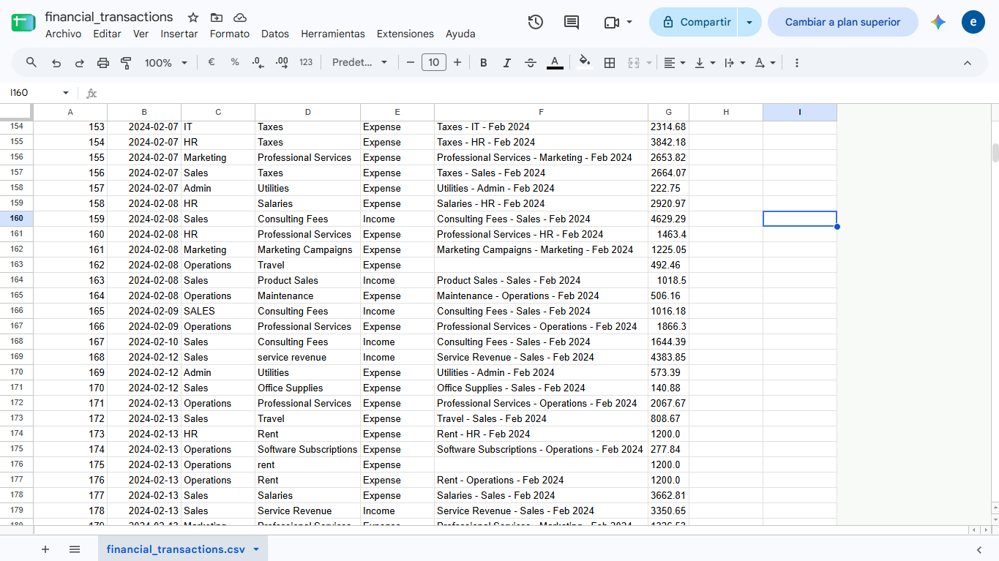
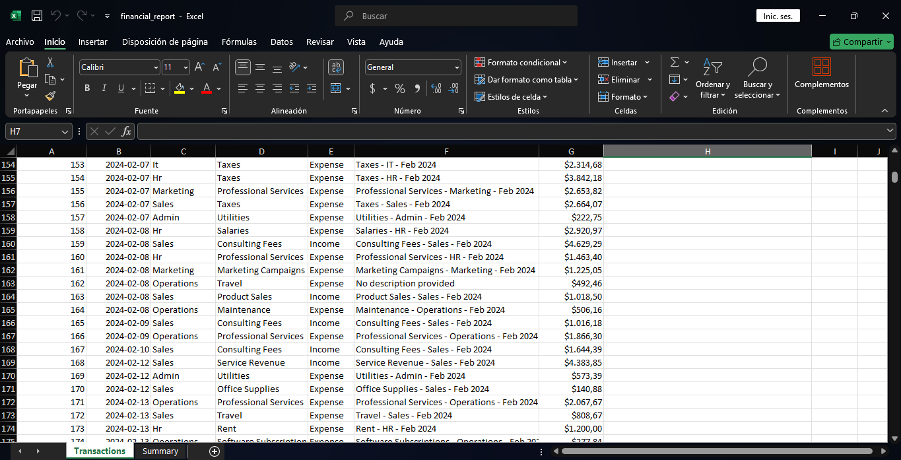
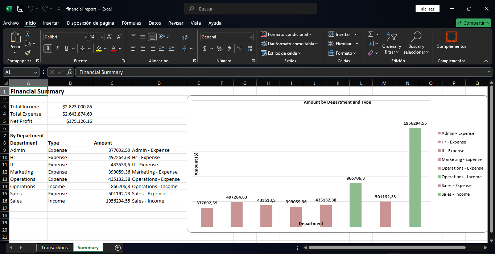

# Automated Financial Report Generator

Python script that transforms raw, messy transaction data into a polished, client-ready Excel financial report — automatically.

## Business Problem

Small businesses and freelance clients often track income and expenses in a raw spreadsheet export with inconsistent formatting (mixed capitalization, extra spaces, missing descriptions) and no summary view. Building a clean P&L report manually every month is repetitive, error-prone, and takes hours.

**This script solves that:** feed it the raw transaction file, and it delivers a formatted two-sheet Excel workbook — cleaned data plus an executive summary with an embedded chart — in seconds. The value sold here isn't the code itself; it's the time saved and the recurring workflow automated.

## Dataset

Synthetic financial transactions dataset simulating two years of business activity:

- **2,619 transactions** | 7 columns | Jan 2024 – Dec 2025
- Departments: Sales, Marketing, Operations, HR, IT, Admin
- 4 income categories (Product Sales, Service Revenue, Consulting Fees, Other Income) + 10 expense categories
- Intentional data quality issues: inconsistent capitalization/spacing in `Category` and `Department` (~5%), empty `Description` fields (~2%), 2 large one-time transactions requiring business-context review

## What the Script Does

**1. Data Cleaning**
- Normalizes text casing/spacing in `Category` and `Department` via automated diagnostic (compares unique value counts before/after normalization to catch inconsistencies without manual inspection)
- Converts date column to proper datetime type
- Fills missing `Description` values with a clear placeholder
- Flags high-value expenses (`Amount > 5000` and `Type == Expense`) for review

**2. Outlier Handling — Documented, Not Deleted**
Two large transactions ($18,500 and $9,200) were investigated rather than dropped. Statistical outlier detection (IQR) was tested but proved unreliable here because it mixes categories of very different natural scale (e.g., Salaries vs. Office Supplies). Final approach: verify the transactions are legitimate, then flag them with a `Notes` column explaining the context — transparency over blind rule-based deletion.

**3. Report Generation (openpyxl)**
- **Transactions sheet:** full cleaned dataset, formatted currency and date columns, wrapped text for outlier notes
- **Summary sheet:** total income, total expense, net profit, and a department/type breakdown with an embedded bar chart
- Chart refinements: bold currency data labels, color-coded bars (green = income, red = expense), muted gridlines — a polished, presentation-ready visual rather than a default Excel chart

## Tech Stack

- **pandas** — data loading, cleaning, aggregation
- **openpyxl** (incl. `openpyxl.chart`) — Excel report generation, formatting, embedded charts
- Deliberately built without Power BI to differentiate this project from the dashboard-focused pieces in this portfolio and demonstrate a code-based reporting pipeline

## How to Run

```bash
pip install pandas openpyxl
python generate_report.py
```
Output: `financial_report.xlsx`

## Screenshots





## Why This Matters for Clients

This is the kind of recurring reporting task freelance clients pay for monthly: raw export in, formatted report out, no manual spreadsheet work. The full pipeline this project demonstrates — extract → clean → aggregate → deliver — is the same shape used for automated reporting gigs on Upwork and Fiverr.

## Related Portfolio Projects

- [HR/Payroll Analytics](https://github.com/EdgarRMJ/proyecto-rrhh-analytics) — SQL + Power BI
- [Retail Sales Analysis](https://github.com/EdgarRMJ/ventas-retail) — SQL + Power BI
